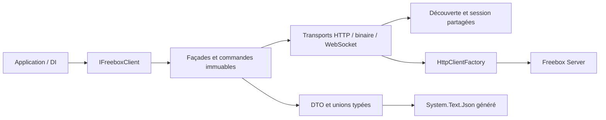

# Freenaute — Freebox Server SDK

Client Freebox Server en **C# 14 / .NET 10**, construit sur `System.Net.Http` et
`Microsoft.Extensions.Http`. Il propose des façades typées, des commandes fluentes,
l'injection de dépendances standard et une sérialisation compatible **NativeAOT**.

Le SDK s'appuie sur l'instantané documentaire **API 16.0 du 2 octobre 2026**.
Les opérations et champs explicitement obsolètes sont exclus. La version majeure
du Server est découverte à l'exécution ; les signatures historiques des exemples
restent des preuves documentaires, sans ajouter des branches de compatibilité.

[Architecture](docs/architecture.md) · [Contrats du protocole](docs/sdk-contracts.md) ·
[Couverture et limites](docs/freebox-official/README.md) ·
[Documentation .NET](Tools/Freenaute.Freebox.Documentation/README.md)

## Prérequis et installation

- SDK .NET **10.0.401**, défini dans [global.json](global.json).
- Une Freebox Server et une autorisation d'application pour les opérations authentifiées.
- Un compilateur natif pour publier une application en NativeAOT.

Le dépôt contient les bibliothèques et leurs références de projets. Depuis votre
application, ajouter une référence au client :

```bash
dotnet add MonApplication.csproj reference chemin/Libs/Freenaute.Freebox.Client/Freenaute.Freebox.Client.csproj
```

Les versions NuGet sont centralisées dans [Directory.Packages.props](Directory.Packages.props)
et verrouillées par les fichiers `packages.lock.json`. Les tests, le sample et les
outils documentaires utilisent exclusivement .NET ; aucune dépendance Python ou Node
n'est nécessaire.

## Démarrage avec l'injection de dépendances

```csharp
using Freenaute.Freebox.Client;
using Microsoft.Extensions.DependencyInjection;

var services = new ServiceCollection();

services.AddFreeboxClient(options => options
    .UseCredentials(applicationId, appToken)
    .WithApplicationVersion("1.0.0")
    .WithTimeout(TimeSpan.FromSeconds(30)));

using var provider = services.BuildServiceProvider();
var freebox = provider.GetRequiredService<IFreeboxClient>();

var version = await freebox.Discovery.GetApiVersionAsync(cancellationToken);
var connection = await freebox.Network.Connection.GetStatusAsync(cancellationToken);
var cameras = await freebox.Cameras.ListAsync(cancellationToken);
```

L'origine par défaut est `https://mafreebox.freebox.fr/`. `UseServer(Uri)` permet de
choisir explicitement une autre origine. Le handler DI utilise les deux racines
françaises publiées par Freebox, avec validation de la chaîne, du nom d'hôte et de
l'usage serveur TLS. La découverte ne déplace jamais les credentials vers un domaine
annoncé par le serveur.

`AddFreeboxClient` retourne un `IHttpClientBuilder` Microsoft. Vous pouvez composer
`ConfigureHttpClient`, `ConfigurePrimaryHttpMessageHandler` et `AddHttpMessageHandler`.
Une registration représente une Freebox et une identité d'application par conteneur ;
les façades partagent la découverte et la session, tandis que la factory gère les
connexions HTTP. Un `HttpClient` fourni directement à `FreeboxClient` conserve son
handler, sa configuration et sa propriété, sauf transfert explicite.

## Autoriser une application

La découverte et l'enrôlement fonctionnent sans credentials. L'application demande
une autorisation, l'utilisateur l'accepte sur la Freebox, puis l'application conserve
son token dans son propre stockage de secrets.

```csharp
using Freenaute.Freebox.Mapper.ClientSide.Authentication.Login;

var authorization = await freebox.Authentication.AuthorizeAsync(
    new TokenRequest(
        "fr.example.application",
        "Mon application",
        "1.0.0",
        Environment.MachineName),
    cancellationToken);

var status = await freebox.Authentication.WaitForAuthorizationAsync(
    authorization.TrackId,
    cancellationToken: cancellationToken);
```

Après acceptation, configurer `UseCredentials` avec l'identifiant d'application et
le token obtenu lors de la demande. L'ouverture de session utilise le challenge
HMAC-SHA1 prescrit par Freebox. Les ouvertures concurrentes sont coordonnées ; chaque
requête reçoit son propre en-tête d'authentification. Aucun token n'est stocké dans le dépôt.

## Commandes fluentes et mises à jour précises

Les sélecteurs et commandes sont immuables. Leur construction ne déclenche aucune
requête ; la méthode terminale exprime l'envoi.

```csharp
await freebox.AirMedia
    .Receiver("Salon")
    .PlayVideo("https://media.example/video.mp4")
    .AtPercent(30m)
    .SendAsync(cancellationToken);

await freebox.AirMedia
    .Receiver("Salon")
    .StopVideo()
    .SendAsync(cancellationToken);

await freebox.Services.Ftp
    .Configure()
    .With(configuration => configuration with { Enabled = false })
    .SendAsync(cancellationToken);
```

`AtPercent(30m)` représente 30 %. La méthode `At(30000)` utilise directement l'unité
filaire : pourcentage multiplié par 1 000. Les commandes d'arrêt omettent `media`.

Les DTO de modification utilisent `Optional<T>` : champ non fourni, `false`, zéro
et `null` sont distincts. Un champ non fourni est omis ; les valeurs explicites
sont conservées. Les façades refusent un `null` de requête lorsqu'il n'est pas attesté
par le contrat. Les formes contradictoires documentées utilisent des unions bornées
qui conservent le type JSON reçu, notamment chaîne/entier et objet/tableau.

## Fichiers, transferts et événements

```csharp
using Freenaute.Freebox.Mapper.Contracts.Primitives;

var directory = EncodedFreeboxPath.FromUtf8Path("/Disque dur/Téléchargements");

var added = await freebox.Files.Downloads
    .FromUrl("https://downloads.example/archive.zip")
    .ToDirectory(directory)
    .WithFileName("archive.zip")
    .AddAsync(cancellationToken);
```

Les chemins Freebox conservent leur Base64 et leurs octets UTF-8, sans normalisation
Unicode ni conversion en Base64URL. Les formulaires et multipart utilisent les types
HTTP standard. Un téléchargement binaire renvoie un `FreeboxDownload` à disposer après
lecture ; sa propriété `Content` fournit le flux, avec annulation et délai appliqués
aux lectures du corps.

Le transport WebSocket réutilise l'origine, le handler TLS et la session HTTP.
Les événements Server et l'upload moderne suivent leurs contrats : corrélation
`request_id`, acquittement initial, réception concurrente des progressions et
confirmation de finalisation. L'upload HTTP obsolète est exclu. Une annulation ferme
la connexion et conserve le fichier partiel ; la suppression par `upload_cancel`
reste une action explicite.

## Domaines

| Façade | Responsabilités |
| --- | --- |
| `Discovery` / `Authentication` | Découverte, autorisation, challenge, session |
| `Network` | Connexion, LAN, DHCP/DHCPv6, NAT, IGD, Freeplug, SFP, switch, WiFi |
| `Services` | Téléphonie, contacts, FTP/TFTP, partages, UPnP AV, VPN, Player, PVR |
| `Files` | Fichiers, tâches, téléchargements, feeds, partages, stockage, RAID, VM, statistiques |
| `SystemHome` | Système, langue, écran, LED, veille, mises à jour, domotique, profils |
| `Cameras` / `Notifications` | Caméras et cibles de notifications |
| `AirMedia` | Configuration, récepteurs et lecture |
| `WebSockets` | Événements et upload moderne |
| `Transport` / `BinaryTransport` / `WebSocketTransport` | Extensions avec contrats et métadonnées explicites |

La [couverture vérifiable](docs/freebox-official/README.md) rapproche les opérations
avec leurs sources. Quelques contrats restent non exposés parce que la documentation
ne fournit pas une route, un encodage ou un type suffisant. Ces limites sont localisées ;
le dépôt ne revendique ni un SDK exhaustif ni une validation métier sur une Freebox réelle.

## Architecture et NativeAOT



| Projet | Rôle |
| --- | --- |
| `Libs/Freenaute.Freebox.Client` | DI, façades, commandes, session et transports |
| `Libs/Freenaute.Freebox.Mapper` | Contrats filaires, primitives et contextes JSON générés |
| `Tests` | Contrats, HTTP/TLS, concurrence, transferts, WebSocket et intégrité documentaire |
| `Samples/Freenaute.Freebox.AotSmoke` | Parcours représentatifs publiés et exécutés en natif |
| `Tools/Freenaute.Freebox.Documentation` | Vérification, contexte et couverture du corpus en C# |
| `docs` | Architecture, preuves documentaires, revues et limites d'implémentation |

Les bibliothèques sont marquées `IsAotCompatible`. Les tests et le sample désactivent
la réflexion JSON. Chaque contrat utilise des `JsonTypeInfo<T>` générés ; une extension
consommatrice fournit ses propres métadonnées. Le Source Generator intégré de
`System.Text.Json` suffit à cette architecture.

Les requêtes et mutations ne sont pas rejouées automatiquement, y compris les GET
documentés avec un effet de bord. Les erreurs HTTP et les enveloppes JSON d'échec
sont exposées par `FreeboxApiException`. Les flux binaires conservent les octets bruts.
La session invalide est supprimée pour l'appel explicite suivant.

## Développer et vérifier

Depuis la racine du dépôt :

```bash
dotnet restore Freenaute.Freebox.sln --locked-mode
dotnet test Freenaute.Freebox.sln -c Release --no-restore
dotnet run --project Tools/Freenaute.Freebox.Documentation -- verify
dotnet run --project Tools/Freenaute.Freebox.Documentation -- context
dotnet run --project Tools/Freenaute.Freebox.Documentation -- coverage

dotnet restore Samples/Freenaute.Freebox.AotSmoke -r linux-x64 --locked-mode
dotnet publish Samples/Freenaute.Freebox.AotSmoke -c Release -r linux-x64 --no-restore
./artifacts/publish/Freenaute.Freebox.AotSmoke/release_linux-x64/Freenaute.Freebox.AotSmoke
```

Les résultats de compilation, tests et publication sont regroupés sous `artifacts/`
et ignorés par Git. La CI exécute les tests en Debug et Release, vérifie le corpus,
puis publie et exécute le sample NativeAOT. Les avertissements sont traités comme des erreurs.

Le [corpus de référence](docs/freebox-official/README.md) contient 45 modules,
195 objets déclarés et 1 254 propriétés actives. Les originaux fournis sont conservés
byte pour byte, avec leurs empreintes. Les ressources HTML/CSS/JavaScript du SDK
archivé sont des pièces documentaires et ne sont pas exécutées par le projet.
