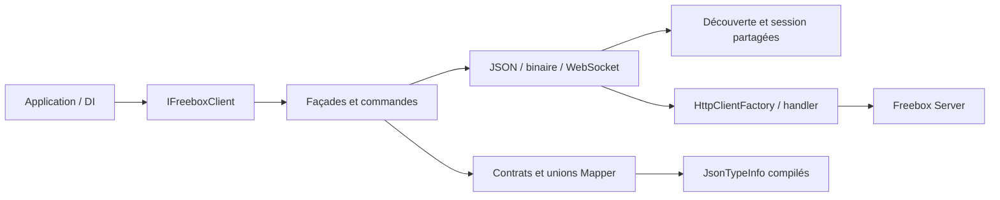

# Architecture du SDK Freebox Server

Le dépôt cible exclusivement **C# 14 et .NET 10**. Le SDK repose sur `System.Net.Http`,
`Microsoft.Extensions.Http` et les métadonnées compilées de `System.Text.Json`. Les
[manifestes d’implémentation](implementation/) relient les opérations disponibles aux
contrats revus ; les lacunes documentaires restent localisées et explicites.

## Couches et responsabilités

| Couche | Responsabilité |
| --- | --- |
| `Freenaute.Freebox.Client` | DI, façades, commandes, découverte, session et transports |
| `Freenaute.Freebox.Mapper` | DTO filaires, primitives, unions et contextes JSON générés |
| `Tools/Freenaute.Freebox.Documentation` | Vérification hors ligne, contexte et couverture des sources |
| `Tests` et sample NativeAOT | Contrats, I/O, concurrence et parcours exécutables représentatifs |

`IFreeboxClient` compose les façades `Discovery`, `Authentication`, `AirMedia`,
`Cameras`, `Notifications`, `Network`, `Services`, `Files`, `SystemHome` et
`WebSockets`. Les domaines réutilisent `IFreeboxTransport`, `IFreeboxBinaryTransport`
et `IFreeboxWebSocketTransport`. Ils ne créent ni moteur HTTP ni session indépendante.

## Composition et durée de vie

`AddFreeboxClient` retourne le `IHttpClientBuilder` standard. L’application compose
ses handlers et sa configuration HTTP avec les extensions Microsoft. Une registration
représente une origine Freebox et une identité d’application par conteneur ; les
façades transientes partagent l’état de découverte et de session. La factory possède
les handlers et gère leurs connexions. Un `HttpClient` fourni directement conserve
sa configuration et sa propriété, sauf transfert explicite.

La découverte et l’ouverture de session sont coordonnées. Le token est ajouté à
chaque requête, sans en-tête global mutable. Les ressources et commandes fluentes
sont immuables ; leur construction ne déclenche aucune I/O. La méthode terminale
exprime l’envoi, et les opérations asynchrones acceptent `CancellationToken`.

## Contrats et sérialisation

Les DTO de lecture, création, modification et action sont distincts. `Optional<T>`
distingue omission, valeur et null explicite : un `false` ou zéro fourni reste envoyé.
Les champs non définis sont omis ; les façades refusent les nulls de requête non
attestés. Les champs de lecture seule ne deviennent pas des paramètres de mutation.

Les unions bornées conservent les formes documentées, notamment chaîne/entier et
objet/tableau. Elles ne transforment pas silencieusement un nom JSON, un identifiant,
un chemin ou un type scalaire. `JsonElement` est réservé aux contenus réellement
ouverts et aux détails d’erreur. Un type manquant reste une limite du manifeste.

Chaque domaine possède son contexte `System.Text.Json` et fournit des
`JsonTypeInfo<T>` explicites au transport. Les converters sont fermés, sans factory
réfléchie ni `dynamic`. Le Source Generator JSON intégré suffit ; aucun générateur
Roslyn personnalisé n’est nécessaire à l’architecture actuelle. Les extensions
consommatrices fournissent leurs propres métadonnées générées.

## Transports et origine

L’origine par défaut est `https://mafreebox.freebox.fr/`. Les deux racines françaises
Freebox sont limitées au handler, avec contrôle de chaîne, nom d’hôte et usage serveur
TLS. Le remplacement du handler reste une décision de l’application. La découverte
ne déplace pas les credentials vers un domaine annoncé. Les détails de routage,
TLS, erreurs et permissions sont dans [les contrats transversaux](sdk-contracts.md).

Le transport JSON traite le statut HTTP et l’enveloppe `success`, puis désérialise
le résultat avec ses métadonnées. Le délai couvre aussi la lecture du corps. Les
formulaires et multipart utilisent les types HTTP Microsoft ; la propriété du
contenu transmis est transférée à l’opération.

Un `FreeboxDownload` possède sa réponse et son flux `Content` ; l’appelant le dispose
après lecture. Le transport WebSocket partage origine, handler et session. Les
connexions ont une lecture coordonnée, des envois sérialisés et une borne mémoire.
Les événements et l’upload moderne sont implémentés séparément du JSON HTTP.
L’annulation ou la fermeture d’un upload conserve le fichier partiel ; sa suppression
par `upload_cancel` est explicite. Aucun appel n’est rejoué automatiquement.

## Preuves et validation

Le [corpus actif](freebox-official/current.json) sélectionne l’instantané fourni
API **16.0**. Ses empreintes établissent l’intégrité des octets, sans preuve de
fraîcheur universelle. L’archive publique v4 reste historique. Les exclusions
s’appliquent exactement au champ, modèle ou opération explicitement obsolète.

Le [contexte .NET](freebox-official/context-net10/README.md) prépare les lectures.
La [couverture .NET](freebox-official/coverage-net10/README.md) rapproche les
manifestes avec leurs sources ; elle ne valide pas les corps C# ni un serveur réel.
Les tests de contrats et la publication/exécution du sample NativeAOT complètent ces
preuves. `IsAotCompatible` seul ne suffit pas. La validation courante est publiée
[dans son rapport](freebox-official/validation.md), sans figer ici un compte de tests.
